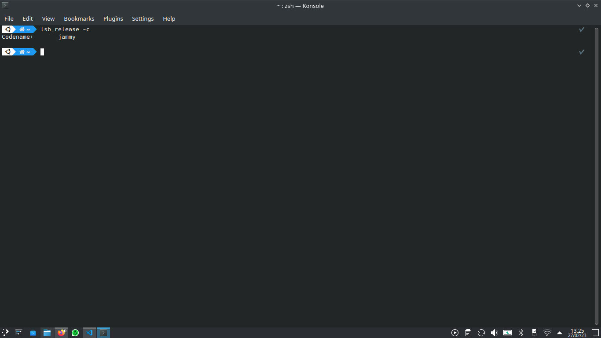
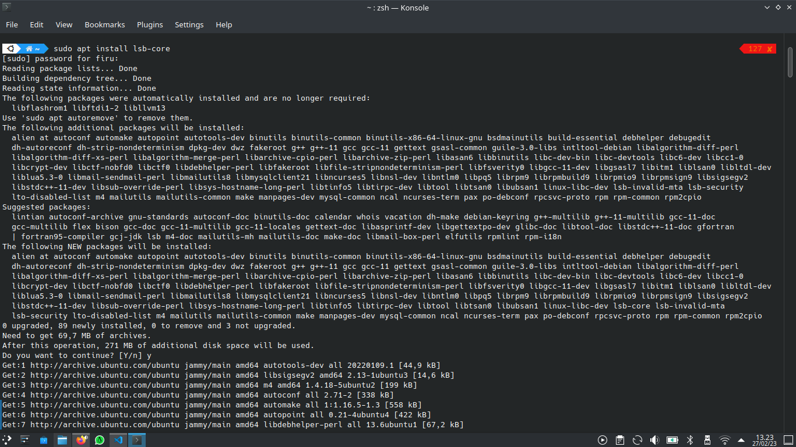
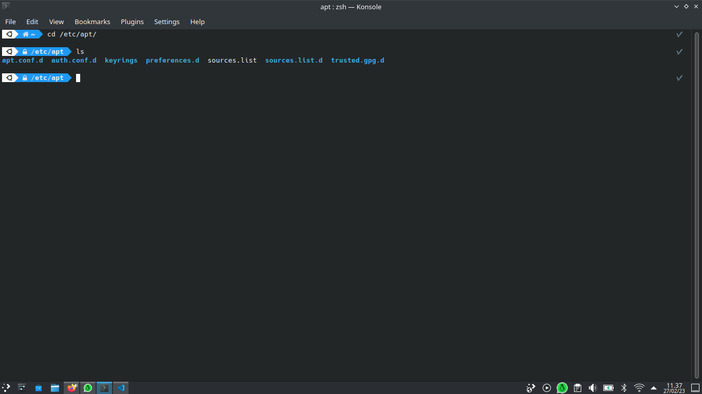
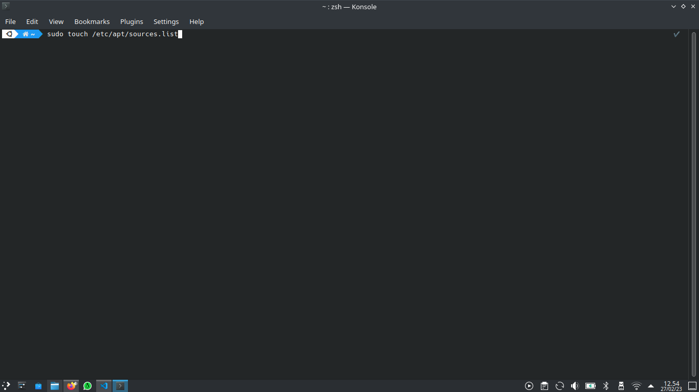
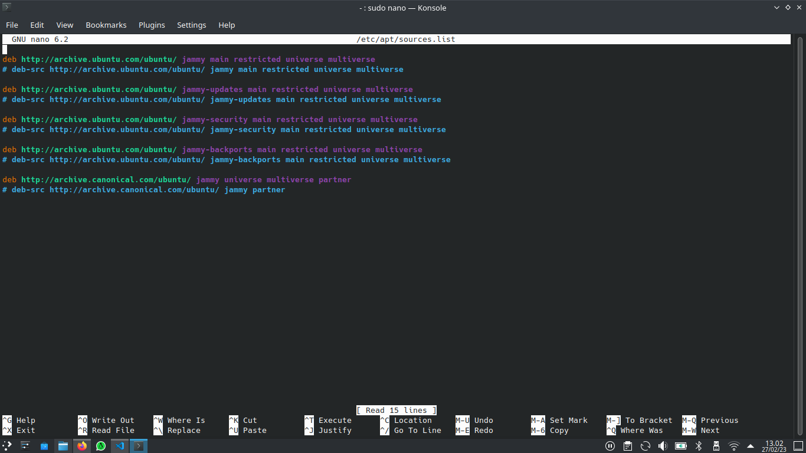

# tutorial fixing repository in kubuntu

 in this case is when you want to install a package on linux kubuntu 20.04Lts with the codename jammy jellyfish you get a problem like this,

```
E:Unable to locate "your peckage"
```

## you can fix it in the way below :
### 1. make sure to know the codename of the linux you are using and for example I am here using kubuntu linux with the codename "jammy"


and if there is writing like 
```
command not found :lsb
```

you can instal lsb-core 


### 2. Open your source.list in /etc/apt/source.list



### 3. You delete source.list with this command 

```
sudo rm /etc/apt/source.list
```


### 4. you create new source.list 

```
sudo touch /etc/apt/source.list
```


### 5. and now open the source.list that you have created

``` 
sudo nano /etc/apt/source.list
```
and after you open it, it must be empty and then fill in the kubuntu repository above ( repository-kubuntu-jammy-jellifish ).



### 6. And then save by "ctrl+x" then "enter"

### 7. And then update 
``` 
sudo apt update
```

### 8. Upgrade
```
sudo apt upgrade
```
wait for it to finish

### 9. if it's finished, congratulations your Linux can be used and there is no writing like 
```
E:unable to locate 'your package'
```


